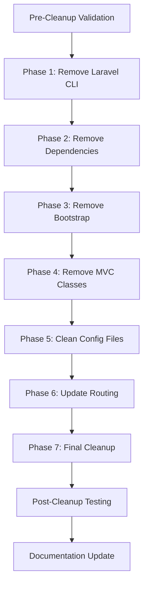

# ITSPtickets Laravel Infrastructure Cleanup Strategy

## Executive Summary

The ITSPtickets system has successfully migrated to the Simple Model architecture, rendering all Laravel/MVC infrastructure obsolete. This strategy outlines the safe removal of Laravel components while preserving the fully functional Simple Model implementation.

## Cleanup Phases



## Detailed Implementation Plan

### Phase 1: Laravel Command-Line Interface Removal
**Target Files:**
- `artisan` (Laravel CLI tool)

**Actions:**
- Delete the artisan file completely
- Verify no scripts reference artisan commands

**Risk Level:** 🟢 Low - CLI tool not used in web application

### Phase 2: Dependency Management Cleanup  
**Target Files:**
- `composer.json` (Laravel framework dependencies)
- `vendor/` directory (if exists)

**Actions:**
- Remove composer.json entirely
- Delete vendor directory if present
- No replacement needed (Simple Model uses direct PHP)

**Risk Level:** 🟢 Low - Dependencies not used in Simple Model

### Phase 3: Laravel Bootstrap Removal
**Target Files:**
- `bootstrap/app.php`
- `bootstrap/` directory

**Actions:**
- Delete entire bootstrap directory
- Remove Laravel application initialization

**Risk Level:** 🟢 Low - Simple Model doesn't use Laravel bootstrapping

### Phase 4: MVC Classes Removal
**Target Files:**
- `app/` directory (complete removal)
  - Controllers, Models, Console, Auth, Exceptions
  - All Laravel MVC infrastructure

**Actions:**
- Delete entire app directory
- Verify no Simple files reference these classes

**Risk Level:** 🟡 Medium - Largest deletion, requires verification

### Phase 5: Configuration Cleanup
**Target Files:**
- `config/app.php` (Laravel-specific config)

**Preserve:**
- `config/database.php` (required for Simple Model)

**Actions:**
- Delete Laravel-specific configuration
- Keep only database configuration

**Risk Level:** 🟢 Low - Database config preserved

### Phase 6: Routing Simplification
**Target Files:**
- `public/index.php`

**Actions:**
- Remove Laravel-specific routing logic
- Simplify to basic PHP redirects only
- Maintain existing redirect functionality

**Risk Level:** 🟡 Medium - Critical routing component

### Phase 7: Final Infrastructure Cleanup
**Target Files:**
- `.htaccess` (remove Laravel directory restrictions)

**Actions:**
- Remove Laravel directory access restrictions
- Keep Simple Model optimizations
- Maintain security headers

**Risk Level:** 🟢 Low - Minor modifications only

## Safety Measures

### Pre-Cleanup Validation
1. **Functionality Test**: Verify all Simple Model files work correctly
2. **Database Test**: Confirm database connections active
3. **Authentication Test**: Verify login/logout functionality
4. **API Test**: Test API endpoints respond correctly

### Cleanup Verification Steps
After each phase:
1. **Access Test**: Verify Simple Model files still accessible
2. **Error Log Check**: Monitor for any new errors
3. **Database Connection**: Test database connectivity
4. **Basic Navigation**: Test core user flows

### Rollback Strategy
- Backup documentation already created
- Git commit before each major phase
- Can restore Laravel components if needed (though unlikely)

## Expected Benefits

### Performance Improvements
- **Reduced File Count**: ~50+ files removed
- **Lower Memory Usage**: No Laravel framework overhead
- **Faster Load Times**: Fewer file system operations
- **Simpler Debugging**: No framework abstractions

### Maintenance Benefits
- **Cleaner Codebase**: Only relevant files remain
- **Easier Navigation**: No unused MVC complexity
- **Focused Architecture**: Pure Simple Model approach
- **Reduced Confusion**: No conflicting patterns

## Post-Cleanup Structure

```
ITSPtickets/
├── *-simple.php           # Core Simple Model files
├── login.php / logout.php # Simple Model authentication  
├── api/tickets.php        # Simple Model API
├── config/database.php    # Database configuration only
├── database/              # Schema and data (preserved)
├── css/ js/               # Frontend assets (preserved)
├── public/index.php       # Simplified routing only
├── .htaccess              # Optimized for Simple Model
└── *.md                   # Documentation (updated)
```

## Implementation Timeline

### Recommended Execution Order
1. **Immediate**: Phases 1-3 (Low risk, Laravel CLI/dependencies)
2. **Careful**: Phase 4 (MVC classes removal - largest impact)
3. **Testing**: Phase 5-6 (Configuration and routing changes)
4. **Final**: Phase 7 (Infrastructure cleanup)
5. **Validation**: Complete system testing

### Estimated Duration
- **Planning Phase**: Complete ✅
- **Implementation**: 30-45 minutes
- **Testing Phase**: 15-20 minutes  
- **Documentation Update**: 10-15 minutes
- **Total**: ~1.5 hours maximum

## Risk Assessment Summary

| Phase | Risk Level | Impact | Mitigation |
|-------|------------|--------|------------|
| CLI Removal | 🟢 Low | None | Direct deletion |
| Dependencies | 🟢 Low | None | No Simple Model impact |
| Bootstrap | 🟢 Low | None | Not used in Simple Model |
| MVC Classes | 🟡 Medium | Large file count | Verify no references |
| Config Files | 🟢 Low | Minimal | Preserve database.php |
| Routing | 🟡 Medium | Core functionality | Test thoroughly |
| Final Cleanup | 🟢 Low | Minor | Simple modifications |

## Success Criteria

### Functional Requirements
- ✅ All Simple Model files remain accessible
- ✅ Database connections work correctly
- ✅ Authentication flows function properly
- ✅ API endpoints respond correctly
- ✅ No broken links or missing resources

### Technical Requirements  
- ✅ No Laravel framework components remain
- ✅ Clean file structure with only used files
- ✅ Optimized performance without framework overhead
- ✅ Updated documentation reflects new structure

## Next Steps

1. **Review and Approve**: User approval of this cleanup strategy
2. **Implementation Mode**: Switch to Code mode for execution
3. **Systematic Execution**: Follow phases in order
4. **Continuous Testing**: Validate after each phase
5. **Final Documentation**: Update architecture documentation

---

**Strategy Status**: 📋 Ready for Implementation  
**Architecture Target**: 🎯 Pure Simple Model  
**Risk Level**: 🟡 Low-Medium (manageable with testing)